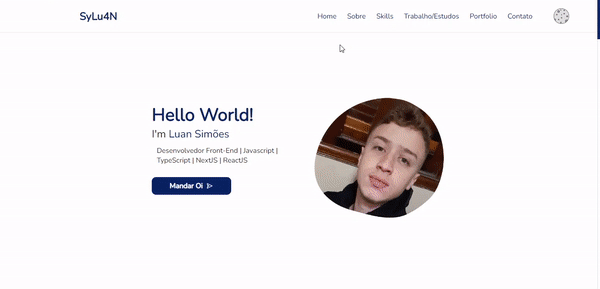

<h1>
  Seja bem vindo ao meu portfolio, ou como costumo dizer...
   
   
  

    
  

   
   
  

    Nele falo um pouco sobre mim, explico minha trajetória até aqui, meus estudos, experiências e também aproveitei para mostrar um pouco do meu trabalho com ReactJs, NextJs, Styled-Components e entre outros... Espero que goste!
  

</h1>

  Portfolio 
  

<h2></h2>

  Código 
  

<h2></h2>

 

  <a href="https://sylu4n.vercel.app/">Link para o portfolio</a>

